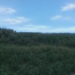
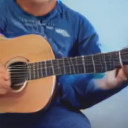
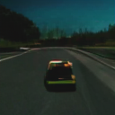
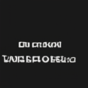

# Sounding Video Generator: A Unified Framework for Text-guided Sounding Video Generation

- This is the official repository of Sounding Video Generator (SVG, [arxiv version](https://arxiv.org/abs/2303.16541), [TMM version](https://ieeexplore.ieee.org/document/10091449)), which is the first unified framework for Text-to-Sounding-Video (T2SV) generation, as is known to us.
- The latest version of the AudioSet-Cap dataset is [VALOR-1M](https://casia-iva-group.github.io/projects/VALOR/download.html), which contains more videos and annotations. The test set could be found at `/assets/AudioSet-Cap_test.json`.

### Sounding Video Samples
Click the picture to jump to play the sounding videos. More sampled videos and audios could be found in assets.

<table style="width:100%">
  <thead>
    <tr>
      <th> Input Text  </th>
      <th> Generated Result  </th>
    </tr>
  </thead>
  <tbody>
   <tr>
      <td >The grass was green, with blue sky and white clouds, and the wind.</td>
      <td align = "center">
       
      </td>
    </tr>
    <tr>
      <td >A man in a blue shirt was playing the guitar.</td>
      <td align = "center">
       
      </td>
    </tr>
    <tr>
      <td >A woman with long hair sang in the room.</td>
      <td align = "center">
       
      </td>
    </tr>
    <tr>
      <td >A man in a suit and glasses speaks indoors.</td>
      <td align = "center">
       
      </td>
    </tr>
    <tr>
      <td >In the game, a yellow car roars along the road.</td>
      <td align = "center">
       
      </td>
    </tr>
    <tr>
      <td >In the music, white text plays in front of a black background.</td>
      <td align = "center">
       
      </td>
    </tr>
  </tbody>
</table>

<!-- https://user-images.githubusercontent.com/37931056/187703869-d074bc6a-c0e1-42d5-b26b-42e3ddd284c4.mp4

https://user-images.githubusercontent.com/37931056/187703898-e89a98d7-377d-49af-9c64-eaf30f2fd057.mp4

https://user-images.githubusercontent.com/37931056/187704788-58d454ac-bad0-4f9f-bd40-7db7557e2446.mp4

https://user-images.githubusercontent.com/37931056/187704747-1a9f3d2d-3671-4fa2-9b25-6cc8c5235318.mp4

https://user-images.githubusercontent.com/37931056/187704874-afcd1f05-1feb-4c7c-9972-1bbc4e3b3254.mp4

https://user-images.githubusercontent.com/37931056/187704910-af06c255-817b-422c-8bb9-f680c8adf3bc.mp4 -->

